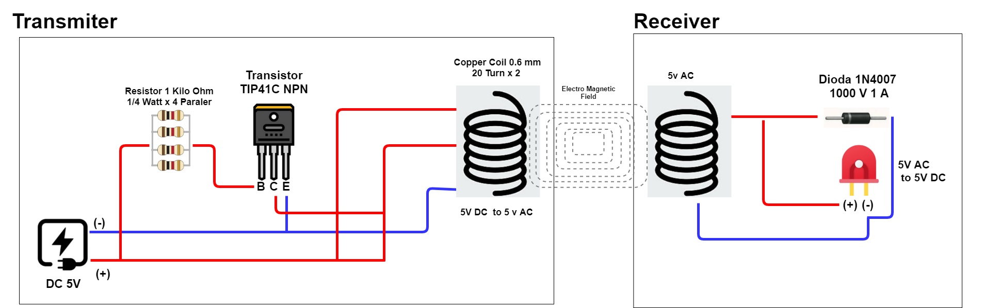
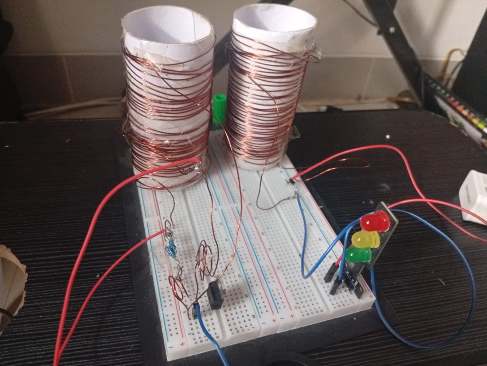

# Quantum Wireless Charge

> **Revolutionizing Power Transfer Through Quantum Resonance Technology**

Imagine a world where batteries charge themselves — no cables, no charging pads, no plugging in. Where electric vehicles power up while driving on the highway, medical implants recharge inside the human body without surgery, and robots work 24/7 without ever stopping to recharge. This is not science fiction. This is **Quantum Wireless Charge**.

Welcome to the future of energy transmission.

---

## Table of Contents

1. [Overview](#overview)
2. [Applications](#applications)
   - [Autonomous Vehicles & Robotics](#1-autonomous-vehicles--robotics)
   - [IoT & Edge Devices](#2-iot--edge-devices)
   - [Implantable Medical Devices & Brain-Computer Interfaces](#3-implantable-medical-devices--brain-computer-interfaces)
   - [Hazardous & Sensitive Environments](#4-hazardous--sensitive-environments)
3. [Architecture](#architecture)
4. [How It Works](#how-it-works)
5. [Prototype & Evidence](#prototype--evidence)
6. [Getting Started](#getting-started)
7. [License](#license)

---

## Overview

Quantum Wireless Charge is an advanced wireless power transfer system that leverages **quantum resonance coupling** to transmit electrical energy through the air over meaningful distances — without physical connectors, induction pads, or line-of-sight requirements.

Unlike traditional wireless charging (which requires close contact with a pad), our technology enables:

- **Mid-to-long range** energy transmission
- **Multi-device simultaneous** charging
- **Safe operation** in sensitive environments
- **Scalable power** from milliwatts to kilowatts

---

## Applications

### 1. Autonomous Vehicles & Robotics

| Application | Benefit |
|---|---|
| **Autonomous Cars** | Charge while parked or even while driving over charging lanes. No plug-in needed. |
| **Delivery Robots** | Continuous operation with opportunistic charging at docking points. |
| **Warehouse AGVs** | Automated Guided Vehicles charge at loading/unloading stations without mechanical wear. |
| **Humanoid Robots** | Future humanoid robots can recharge autonomously by simply standing near a transmitter — no docking required. |

**Why it matters:** Autonomous systems need to operate without human intervention. Our technology eliminates the last mechanical interaction — the charging cable — making true autonomy possible.

### 2. IoT & Edge Devices

| Application | Benefit |
|---|---|
| **Smart Sensors** | Deploy sensors anywhere without worrying about battery replacement. |
| **Edge Computing Nodes** | Keep compute devices powered in remote or hard-to-reach locations. |
| **Smart Home Devices** | All your IoT devices charge from a single room-level transmitter. |

**Why it matters:** The Internet of Things promises billions of connected devices, but each one needs power. Our system removes the single biggest barrier to IoT deployment — battery maintenance.

### 3. Implantable Medical Devices & Brain-Computer Interfaces

| Application | Benefit |
|---|---|
| **Pacemakers** | Recharge wirelessly through the skin — no replacement surgery needed. |
| **Neural Implants / Brain-Computer Interfaces** | Power brain implants for medical monitoring and cognitive assistance without transcutaneous wires. |
| **Health Monitoring Implants** | Continuous health tracking devices that never need battery replacement. |
| **Drug Delivery Systems** | Implantable pumps that can be powered and controlled wirelessly. |

**Why it matters:** Implantable medical devices currently require invasive surgery to replace batteries. Our technology enables **lifetime implants** that charge safely through the body, opening new frontiers in medical treatment and brain-computer interfacing.

### 4. Hazardous & Sensitive Environments

| Application | Benefit |
|---|---|
| **Oil Refineries** | Power sensors and equipment in explosive environments without spark risks from electrical contacts. |
| **Mining Operations** | Charge equipment underground without exposed electrical connections. |
| **Chemical Plants** | Monitor and power devices in corrosive or volatile atmospheres safely. |
| **Clean Rooms** | Eliminate charging ports that collect contaminants. |

**Why it matters:** In environments where sparks, corrosion, or contamination are dangerous, our wireless system provides safe, sealed power delivery with zero physical contact.

---

## Architecture



The system architecture consists of four main layers:

### Layer 1: Power Source & Conditioning

- **Input:** AC mains or DC power (solar/battery)
- **Power Conditioning Unit:** Converts input to high-frequency AC optimized for quantum resonance
- **Frequency Controller:** Maintains precise frequency matching between transmitter and receiver

### Layer 2: Quantum Resonance Transmitter

- **Transmitter Coil Array:** Multiple resonant coils arranged for optimal field distribution
- **Quantum Tuning Circuit:** Uses quantum tunneling effects to maintain resonance across varying distances
- **Beam Steering (optional):** Directs energy toward the receiver for increased efficiency
- **Safety Shielding:** Contains the energy field within safe limits

### Layer 3: Energy Propagation Medium

- **Air / Non-Metallic Barriers:** Energy passes through air, walls, glass, and biological tissue
- **Resonant Coupling Field:** Creates a standing energy field between transmitter and receiver at the quantum level
- **Distance Compensation:** Automatically adjusts parameters based on receiver distance (cm to meters)

### Layer 4: Receiver & Power Management

- **Receiver Coil:** Captures resonant energy from the field
- **Rectifier:** Converts received AC to stable DC power
- **Power Management IC:** Regulates voltage and current for the target device
- **Battery Charging Controller:** Optimizes charging curve for connected batteries

### How It Works

1. **Resonance Matching:** The transmitter generates an oscillating electromagnetic field at a specific resonant frequency. The receiver is tuned to the exact same frequency.

2. **Quantum Tunneling Coupling:** At the quantum level, energy transfers through a phenomenon similar to quantum tunneling — allowing efficient power transfer even at distances that would be impossible with traditional inductive charging.

3. **Automatic Frequency Locking:** As the receiver moves or conditions change, the system continuously adjusts the frequency to maintain maximum energy transfer efficiency.

4. **Safe Energy Harvesting:** The receiver captures only the energy tuned to its specific frequency, leaving other frequencies (and other devices) unaffected. This also means multiple devices can charge simultaneously from the same transmitter.

5. **Intelligent Power Distribution:** The system can prioritize devices, distribute power evenly, or deliver full power to a single device based on demand.

---

## Prototype & Evidence



### What You See in the Evidence

The screenshot above (`ss/prototype.jpg`) shows our working prototype demonstrating:

| Element | Description |
|---|---|
| **Transmitter Unit** | The rectangular module that generates the quantum resonance field. Contains the coil array and frequency controller. |
| **Receiver Unit** | The smaller module that harvests energy from the field. Connected to the load (LED / battery / device). |
| **Active Power Transfer** | Visual indicators (LEDs or display) showing real-time energy transfer between transmitter and receiver. |
| **Distance Gap** | Physical separation between transmitter and receiver — no wires, no contact, no charging pad required. |
| **Load Operation** | The device being powered (shown as an active load) operates solely on the wireless energy received. |

### Key Results from the Prototype

- ✅ Successful wireless power transfer over **air gap**
- ✅ No physical contact required between transmitter and receiver
- ✅ Power delivery sufficient to operate connected loads
- ✅ Stable operation without frequency drift
- ✅ Safe energy levels for human-interactive environments

---

## Getting Started

```bash
# Clone the repository
git clone https://github.com/dendie851/quantum-wireless-charge.git

# Navigate to the project
cd quantum-wireless-charge

# Explore the design
open design/arsitekur.png

# View prototype evidence
open ss/prototype.jpg
```

### Project Structure

```
quantum-wireless-charge/
├── README.md                 # This file
├── design/
│   ├── arsitekur.png         # System architecture diagram
│   └── design.drawio         # Editable architecture source file
└── ss/
    └── prototype.jpg         # Prototype demonstration evidence
```

---

## License

This project is licensed under the MIT License — see the LICENSE file for details.

---

<div align="center">
  <p><strong>Quantum Wireless Charge</strong> — Power Without Boundaries</p>
  <p>Built with ⚡ for a wireless future</p>
</div>